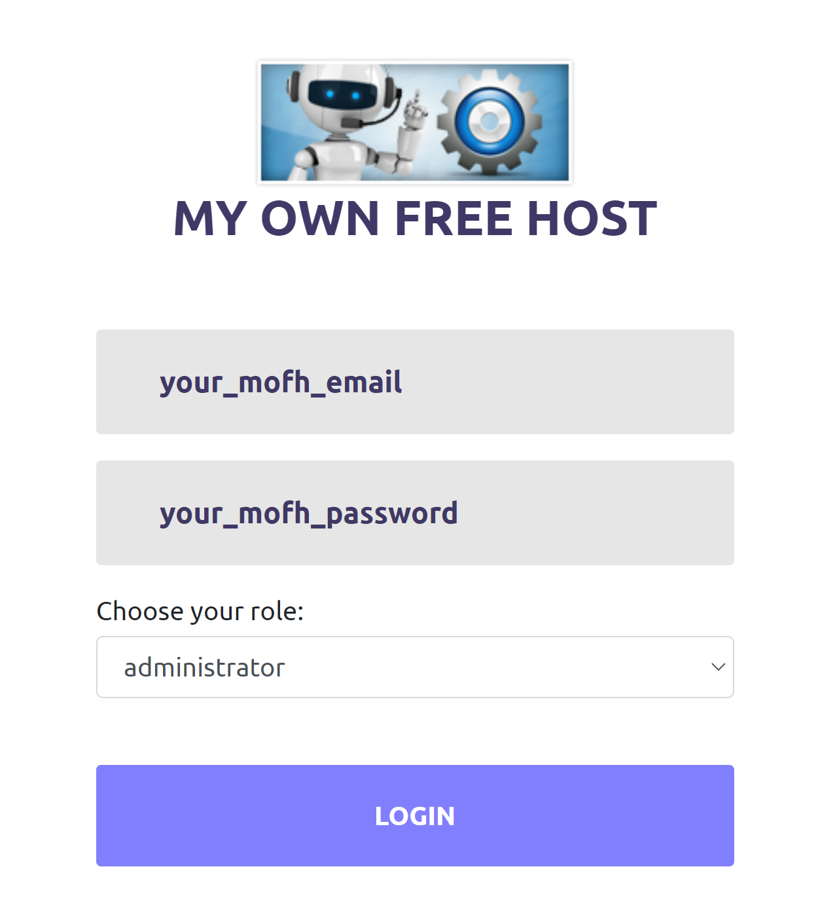
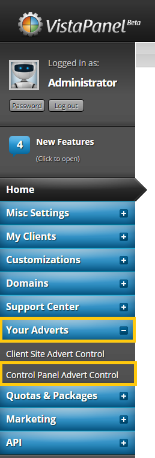
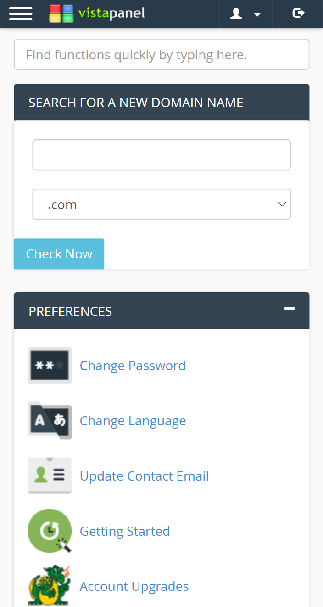

# Using our CDN

This method will guide you through the installation process of using our vistapanel scripts on your vPanel using our CDN. 

!> You must read the [Requirements](https://docs.wybenetwork.com/vistapanel-customizations/#/requirements) before continuing with this method.

We are using example of responsive domain search here. You can download all other scripts from GitHub. At the place of script-name there can be any [script name](https://docs.wybenetwork.com/vistapanel-customizations/#/scripts-name).

## Login to MOFH Panel

1. Open [MyOwnFreeHost (MOFH) Panel](https://panel.myownfreehost.net/).
2. Enter your `email` and `password`.
3. Click on `Login` button.



## Navigate to cPanel Adverts

1. After Successful Login.
2. Find `Your Adverts` in the sidebar.
3. Click on it.
4. Drop-down menu will appear.
5. Click on `Control Panel Adverts Control`.
6. You will be navigated to Control Panel Adverts Control.



## Adding Code

1. A Page Will Open.
2. Select Domain from there of which you want to change script of vPanel.
3. Click on `Add/Change Panel Adverts` button.
4. After Selecting Domain, A New Page will appear where you can add your advertising code.
5. Add this code in the `Top Advert Area`

!> Kindly go through the readme.md file of script which you are installing before going through this documentation.

```html
<script type="text/javascript">
    // Script Configurations, Can be found in readme.md file of each script.
</script>
<script src="https://vpc.cdn.wybenetwork.com/script-name/script-name.js" type="text/javascript"></script>

```
6. Replace `script-name` with the name of any script you want to use in your vPanel. e.g.

   In my case I am using `responsive-domain-search` script, then the code for me will be: 
   ```html
<script type="text/javascript">
    /* OPTIONAL (Founded in Readme.md file)
    var affCode = 'AFFLIATE_CODE_HERE';
    */
</script>
<script src="https://vpc.cdn.wybenetwork.com/responsive-domain-search/responsive-domain-search.js" type="text/javascript"></script>

```

7. After adding this code click on `Add/Change Advert Code` button.
8. After that Logout from vPanel of your website and then re-login to the vPanel of your website.

You will see that the vistapanel script is Successfully Installed on your vPanel!

## Preview


