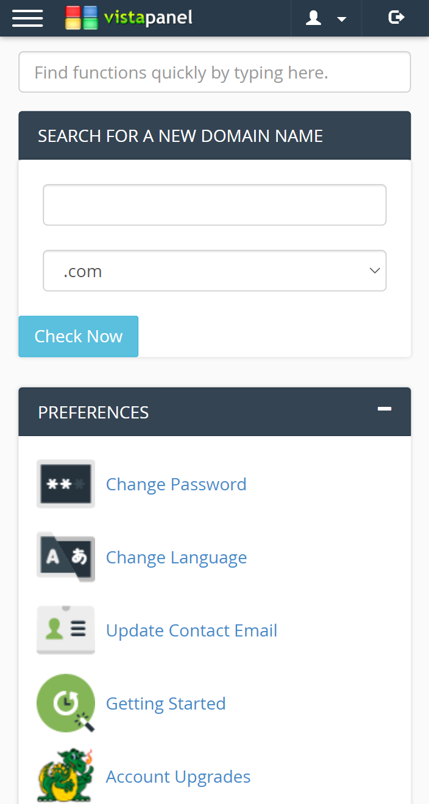

# Manual Installation

This method will guide you through the manual installation process of our Customizations on your vPanel.

!> You must read the [Requirements for Manual Installation](https://docs.wybenetwork.com/vistapanel-customizations/#/requirements?id=requirements-for-manual-installation) before continuing with this method.

We are using example of responsive domain search here. You can download all other scripts from GitHub. At the place of script-name there can be any [script](https://docs.wybenetwork.com/vistapanel-customizations/#/scripts).

!> You are not allowed to remove the credits to authors from any script. You can request credits removal through our [Discord Server](https://discord.gg/zArW8kC).

## Download Scripts

1. Go to [the releases page of VistaPanel Customizations](https://github.com/WybeNetwork/VistaPanel-Customizations/releases).
2. Download the latest available "Source Code (zip)" file.


## Extract & Navigate

1. After downloading the latest release, extract it. Open the extracted folder.
2. Navigate to your desired script folder. There, you will find a file listing like the screenshot shown below.
3. Be sure to read the README.md file, it contains instructions specifically for each script. Alternatively, you can go to our "Code" section below and select the script for which you need instructions.

!> Each script is setup in a different way. You need to read the README.md file of the script you want to use to get the correct guide.


## Upload to your hosting

1. After navigating, select all the files present there.
2. Right click and convert them into zip archive using winrar.
3. After making zip archive of it, login to the control panel of your account or Login via FileZilla using FTP credentials of your account.
4. After that, you can upload and extract zip archive on your hosting or You can directly upload all the files present in "script-name" folder to your website using "FTP" or "File Manager of Control Panel". If you don’t upload all the files then it will cause problems.
5. After uploading get url of `script-name.js`.

URL will be like:
```http
https://yourwebsite.com/script-name.css
```
OR
```http
https://yourwebsite.com/yourdirectory/script-name.css
```

## Login to MOFH Panel

1. Open [MyOwnFreeHost (MOFH) Panel](https://panel.myownfreehost.net/).
2. Enter your `email` and `password`.
3. Click on `Login` button.


## Navigate to cPanel Adverts

1. After Successful Login.
2. Find `Your Adverts` in the sidebar.
3. Click on it.
4. Drop-down menu will appear.
5. Click on `Control Panel Adverts Control`.
6. You will be navigated to Control Panel Adverts Control.


## Adding Code

1. A Page Will Open.
2. Select Domain from there of which you want to change script of vPanel.
3. Click on `Add/Change Panel Adverts` button.
4. After Selecting Domain, A New Page will appear where you can add your advertising code.
5. Add this code in the `Top Advert Area`

!> Each Script have different requirements regarding this. Be sure to read readme.md file of each script for correct guidance.

```html
<script type="text/javascript">
	/* OPTIONAL
	var affCode = 'AFFLIATE_CODE_HERE';
	*/
</script>
<script src="https://yourdomain.com/responsive-domain-search/responsive-domain-search.js" type="text/javascript"></script>
```
6. Replace `yourdomain.com` with the url where you uploaded files
7. After adding this code click on `Add/Change Advert Code` button.
8. After that Logout from vPanel of your website and then re-login to the vPanel of your website.

You will see that the vistapanel script is Successfully Installed on your vPanel!

## Preview


