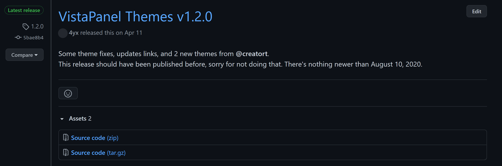
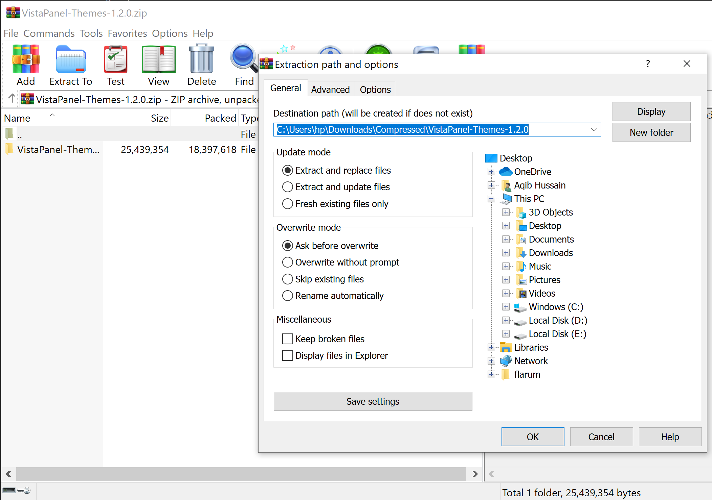
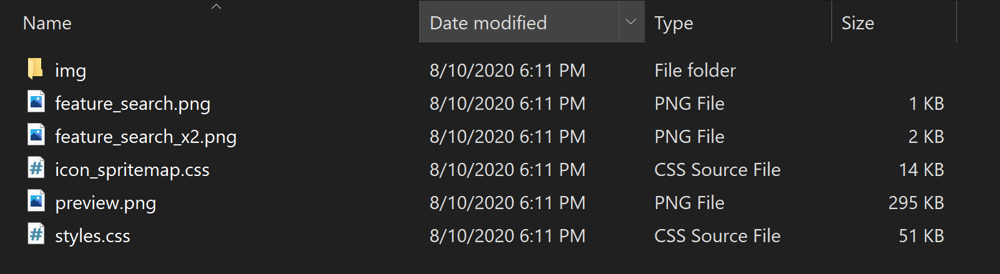
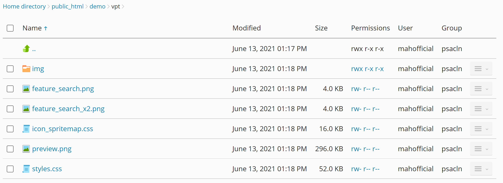
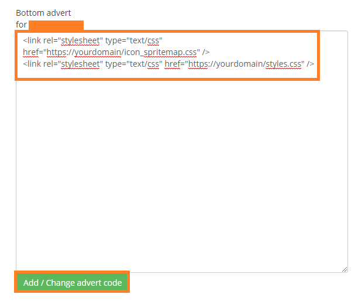

# Manual Installation

This method will guide you through the manual installation process of using our vistapanel themes on your vPanel. 

!> You must read the [Requirements for Manual Installation](https://docs.wybenetwork.com/vistapanel-themes/#/requirement?id=requirements-for-manual-installation) before continuing with this method.

We are using example of gradient-blue theme here. You can download all other themes from GitHub. At the place of theme-name there can be any [theme name](https://docs.wybenetwork.com/vistapanel-themes/#/themes-name).

## Download Theme

1. Goto [VistaPanel Themes](https://github.com/WybeNetwork/VistaPanel-Themes/releases). 
2. Download the latest available "Source Code (zip)" file.



## Extract File

1. After downloading the latest release, extract it.



## Navigate to Desired Theme Folder

1. After Extracting, Open the extracted folder.
2. Navigate to your desired theme folder.
3. After navigating to your desired theme folder, you will find a file listing like the screenshot shown below.



## Upload to your hosting

1. After navigating, select all the files present there.
2. Right click and convert them into zip archive using winrar.
3. After making zip archive of it, login to the control panel of your account or Login via FileZilla using FTP credentials of your account.
4. After that, you can upload and extract zip archive on your hosting or You can directly upload all the files present in "theme-name" folder to your website using "FTP" or "File Manager of Control Panel". If you don’t upload all the files then it will cause problems.
5. After uploading get url of styles.css and icon_spritemap.css. 

URL will be like:
```http
https://yourwebsite.com/styles.css
https://yourwebsite.com/icon_spritemap.css
```
OR
```http
https://yourwebsite.com/yourdirectory/styles.css 
https://yourwebsite.com/yourdirectory/icon_spritemap.css
```



## Login to MOFH Panel

1. Open [MyOwnFreeHost (MOFH) Panel](https://panel.myownfreehost.net/).
2. Enter your `email` and `password`.
3. Click on `Login` button.


## Navigate to cPanel Adverts

1. After Successful Login.
2. Find `Your Adverts` in the sidebar.
3. Click on it.
4. Drop-down menu will appear.
5. Click on `Control Panel Adverts Control`.
6. You will be navigated to Control Panel Adverts Control.


## Adding Code

1. A Page Will Open.
2. Select Domain from there of which you want to change theme of vPanel.
3. Click on `Add/Change Panel Adverts` button.
4. After Selecting Domain, A New Page will appear where you can add your advertising code.
5. Add this code in the `Bottom Advert Area`
```html
<link rel="stylesheet" type="text/css" href="https://yourdomain/icon_spritemap.css" />
<link rel="stylesheet" type="text/css" href="https://yourdomain/styles.css" />
```
6. Replace yourdomain with the url where you uploaded files
7. After adding this code click on `Add/Change Advert Code` button.
8. After that Logout from vPanel of your website and then re-login to the vPanel of your website.



You will see that the vistapanel theme is Successfully Installed on your vPanel!

## Preview

