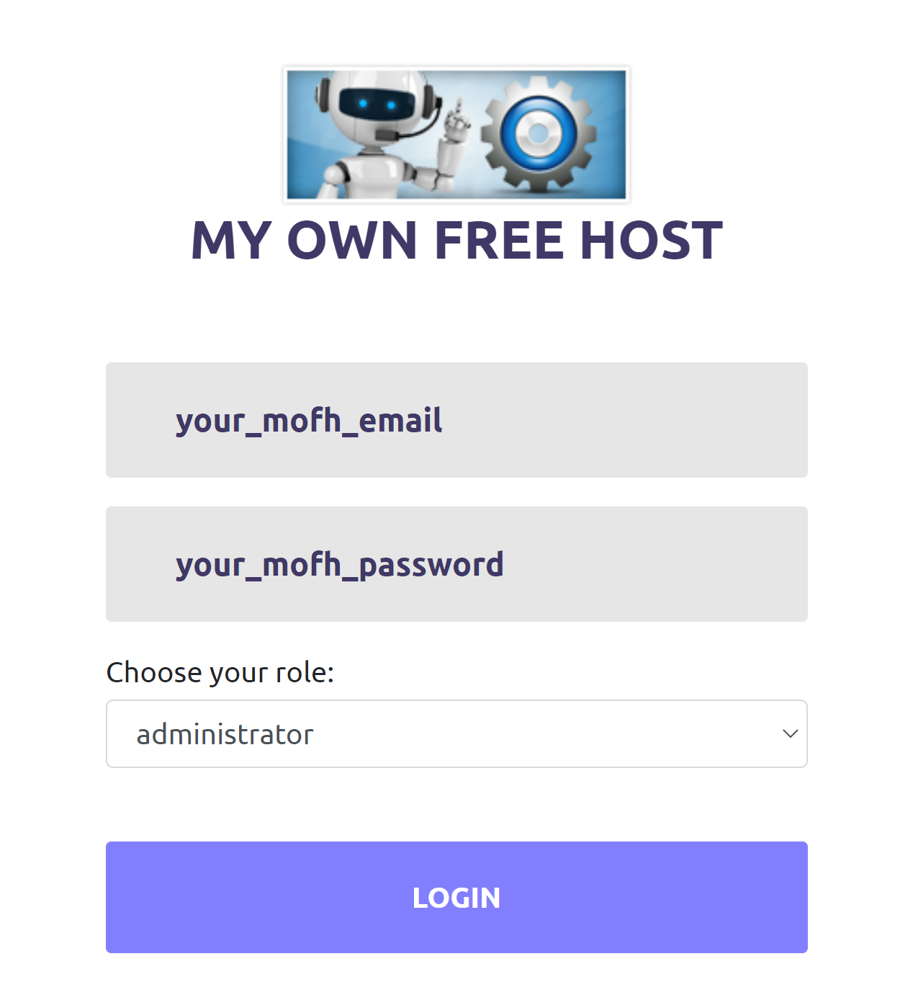
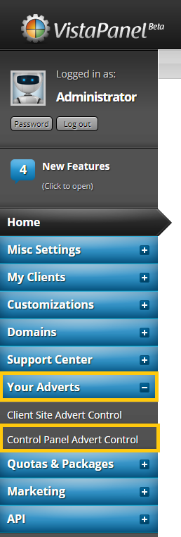
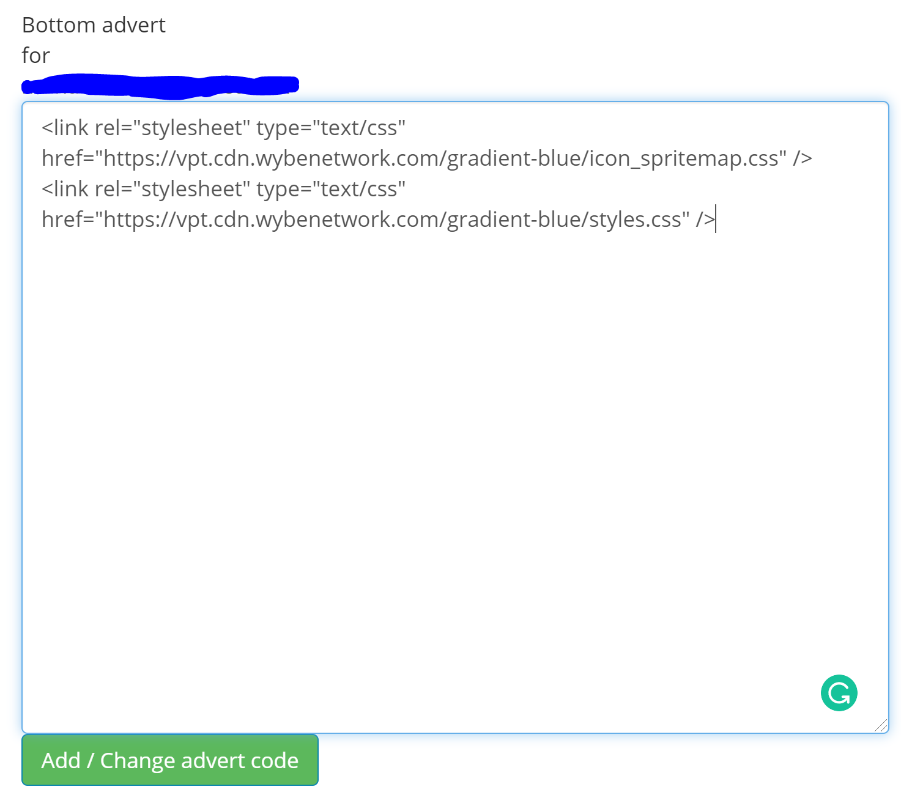
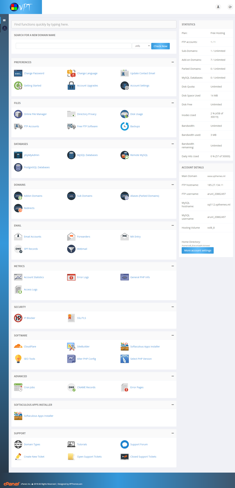

# Manual Installation

This method will guide you through the installation process of using our vistapanel themes on your vPanel using our CDN. 

!> You must read the [Requirements](https://docs.wybenetwork.com/vistapanel-themes/#/requirement) before continuing with this method.

We are using example of gradient-blue theme here. You can download all other themes from GitHub. At the place of theme-name there can be any [theme name](https://docs.wybenetwork.com/vistapanel-themes/#/themes-name).

## Login to MOFH Panel

1. Open [MyOwnFreeHost (MOFH) Panel](https://panel.myownfreehost.net/).
2. Enter your `email` and `password`.
3. Click on `Login` button.



## Navigate to cPanel Adverts

1. After Successful Login.
2. Find `Your Adverts` in the sidebar.
3. Click on it.
4. Drop-down menu will appear.
5. Click on `Control Panel Adverts Control`.
6. You will be navigated to Control Panel Adverts Control.



## Adding Code

1. A Page Will Open.
2. Select Domain from there of which you want to change theme of vPanel.
3. Click on `Add/Change Panel Adverts` button.
4. After Selecting Domain, A New Page will appear where you can add your advertising code.
5. Add this code in the `Bottom Advert Area`
```html
<link rel="stylesheet" type="text/css" href="https://vpt.cdn.wybenetwork.com/theme-name/icon_spritemap.css" />
<link rel="stylesheet" type="text/css" href="https://vpt.cdn.wybenetwork.com/theme-name/styles.css" />
```
6. Replace `theme-name` with the name of any theme you want to use in your vPanel. e.g.

   In my case I am using `gradient-blue` theme, then the code for me will be: 
   ```html
<link rel="stylesheet" type="text/css" href="https://vpt.cdn.wybenetwork.com/gradient-blue/icon_spritemap.css" />
<link rel="stylesheet" type="text/css" href="https://vpt.cdn.wybenetwork.com/gradient-blue/styles.css" />
```

7. After adding this code click on `Add/Change Advert Code` button.
8. After that Logout from vPanel of your website and then re-login to the vPanel of your website.



You will see that the vistapanel theme is Successfully Installed on your vPanel!

## Preview

